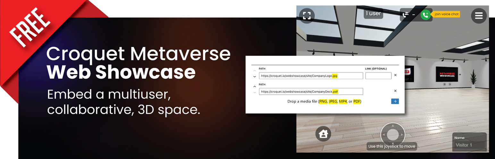

# Croquet Metaverse Web Showcase - WordPress Plugin

|                          | Data                                        |
|--------------------------|---------------------------------------------|
| Contributors             | yoshikiohshima,zfox23                       |
| Tags                     | metaverse, 3d, multiuser                    |
| WordPress Version Tested | 6.1.1                                       |
| Stable Tag               | 1.1.0                                       |
| Requires PHP             | 7.0                                         |
| Requires at least        | 5.9                                         |
| License                  | Apache 2.0                                  |
| License URI              | [https://www.apache.org/licenses/LICENSE-2.0](https://www.apache.org/licenses/LICENSE-2.0) |

## Description

Croquet Metaverse Web Showcase is a new WordPress block which allows people to embed a multiuser, collaborative, 3D space into a WordPress site. A WordPress author can drag images, videos, and PDF files into the block to add their content into the virtual 3D space.

See the plugin in action in this video:
https://www.youtube.com/watch?v=q0cFApaNEBI

Installation is easy. Search for "Croquet Web Showcase" from the plugin installation page.
After installing the plugin, make sure that you have the Croquet API Key for your site. You can create a key for free on https://croquet.io/keys. A key looks like 15kkttz5HqJ4mDycjupJA5eiF2CMhdvIgexample.

Then create the Croquet Metaverse Web Showcase Block in the Block editor. That looks like the first screenshot. Open the sidebar settings for the block by clicking on the the gear icon at the top right corner on the editing page and clicking on the block. You paste the Croquet API into the API Key settings and you are good to go.

There are two default assets already set. We recommend to preview the page at this point. You should see a 3D art gallery space with two images.

When this works, go back to the editing page, and remove the default contents by pressing the "X" buttons on the row. You can drag your own assets into the block to add them. You can rearrange them.

Visit [croquet.io/webshowcase](https://croquet.io/webshowcase) for more information about Web Showcase.

### Features

* Low-latency, real-time virtual collaboration embedded within a WordPress post or page.
* The WordPress block offers a list editor to arrange your space's assets.

### Privacy and Security

* To use this plugin, you must obtain an API key from [https://croquet.io/keys](https://croquet.io/keys).
    * These API keys are public and **not secret**. Usage of the API key can be restricted to a set of URLs.
* Croquet's website uses cookies as per our [Privacy Policy](https://croquet.io/privacy.html).
* Croquet Corporation does not track users.
* Croquet Corporation does not store or control the assets used in a Web Showcase.
* Users in the same session can see the avatars controlled by other users.
* Users in the same session may join a spatialized voice chat to talk.

### Usage
1. Visit [croquet.io/keys](https://croquet.io/keys) and create a production API Key.
    * These API keys are public and **not secret**. Usage of the API key can be restricted to a set of URLs.
2. Instantiate a Croquet Metaverse Web Showcase block in the WordPress block editor
3. Paste the API key into the sidebar settings.
4. Remove the default Showcase contents provided by the plugin with the X buttons.
5. Add your own image/video/PDF content by specifying the URL of the asset or by dragging and dropping a file into the block.

## Settings

### Croquet API Key

The key is used to access the Croquet Reflector network. You can generate an API Key, which is a string looks like 15kkttz5HqJ4mDycjupJA5eiF2CMhdvIgexample on https://croquet.io/keys.

### Create a unique session per visit

When true, a visitor goes into a new Showcase session when they open the WordPress page. When false, they go into the same session. You can still share the session by clicking on the three bar menu within the Shwocase instance and scan the QR code or share the internal link.

### Voice Chat

When true, and if the WordPress is hosted on a secure HTTP connection, the voice chat can be used.

## Screenshots

### The Block Editor View

  
  
### Web Showcase Embedded in a Wordpress Page

  

## Frequently Asked Questions

### What is Croquet Metaverse Web Showcase?

[Croquet Metaverse Web Showcase](https://croquet.io/webshowcase) allows people to embed a multiuser, collaborative, 3D space into any website.

### How much does Web Showcase cost?

Web Showcase is free. You can obtain the Croquet API Key for free from [https://croquet.io/keys](https://croquet.io/keys) and paste it into the sidebar settings panel after selecting the Web Showcase WordPress block.

### What does the WordPress plugin do?

The WordPress plugin allows you to interactively specify what assets to use for a Showcase and run a shared environment on your WordPress site.

## Changelog

### 1.1.0
* fix typo in doc.

### 1.0.9
* show warning when API Key is malformed.

### 1.0.8
* fix typo.

### 1.0.7
* remove showcase name settings as it is now a random name.

### 1.0.6
* remove file type drop down.

### 1.0.5
* Use relative pathname for contents in the media library.

### 1.0.4
* Make sure that latest 6.1.1 is tested.

### 1.0.3
* First public version

### 1.0.2
* Add more settings. Handle errors better.

### 1.0.1
* Code style changes.

### 1.0.0
* The initial submission 🎉
